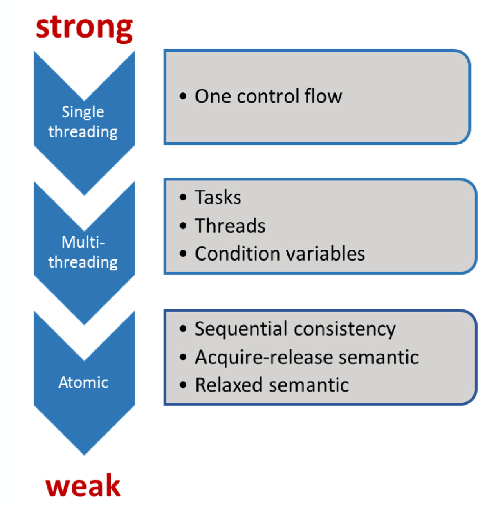
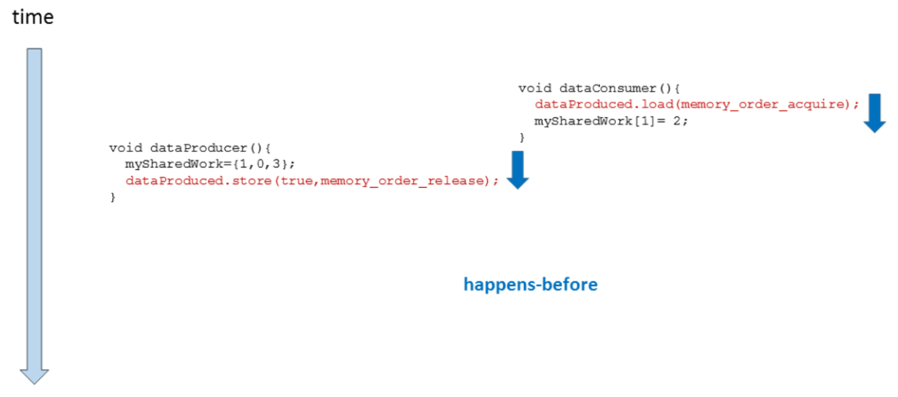

# Chapter 2 Concurrency Programming
## 2.1 thread & jthread
- C++11 引入了 std::thread 类型,其与操作系统提供的线程对应,但该类型有一个严重的设计缺  陷: 不是 RAII 类型。
### thread 存在的问题
std::thread 要求在其生命周期结束时,若表示正在运行的线程,则调用 join()(等待线程结束) 或  detach()(让线程在后台运行)。若两者都没有调用,析构函数会立即导致异常的程序终止 (在某些系统上导致段错误)。  

如果通过确保在离开作用域时调用 join() 来对异常作出反应,而不解决异常。不幸的是,这可能会导致阻塞 (永远)。然而,调用 detach() 也是一个问题,因为线程在程序的后台继续运行,使用 CPU 时间和资源,而这些时间和资源现在可能会销毁。若在更复杂的上下文中使用多个线程,问题会变得更糟,并且会产生非常糟糕的代码。
```c++
void foo(){
  std::thread t1{task1, name, val};
  std::thread t2;
  try {
    t2 = std::thread{task2, name, val};
    ...
  }
  catch(...){
    t1.join();
    if(t2.joinable()) {
      t2.join();
    }
    throw;
  }

  t1.join();
  t2.join();
}

```
### std::jthread
- std::jthread 解决了这些问题,它是 RAII 类型。若线程是可汇入的 (“j”代表“汇入”),析构函数会自动调用 join()。
- 内置停止机制：std::jthread 与 std::stop_token 集成，支持直接请求停止线程
```c++
void foo(){
  std::jthread t1{task1, name, val};
  std::jthread t2{task2, name, val};
  ...

  t1.join();
  t2.join();
}
```
### jthread的停止令牌和停止回调
- 自动管理停止令牌：当使用 std::jthread 时，不需要手动创建 std::stop_source。std::jthread 自动包含一个内部的 std::stop_source，并在启动线程时将相关的 std::stop_token 传递给线程函数。
- 接收停止令牌：线程函数可以直接接受一个 std::stop_token 参数，该令牌由 std::jthread 提供，确保与线程的内部停止机制同步。
- 定期检查停止请求：在线程函数中，应定期调用 std::stop_token::stop_requested() 来检查是否接收到停止请求。这为安全且及时地停止执行提供了机制。
- 响应停止请求：一旦 std::stop_token 表明停止已被请求，线程函数应采取必要的步骤来安全地终止，这可能包括资源的清理和状态的保存。

```c++
#include <iostream>
#include <chrono>
#include <thread>

// 使用 std::jthread 运行的函数
void task(std::stop_token stoken) {
    while (!stoken.stop_requested()) {
        std::cout << "任务正在运行..." << std::endl;
        // 模拟一些工作
        std::this_thread::sleep_for(std::chrono::seconds(1));
    }
    std::cout << "任务已收到停止请求，现在停止运行。" << std::endl;
}

int main() {
    // 创建 std::jthread，自动处理停止令牌
    std::jthread worker(task);

    // 模拟主线程运行一段时间后需要停止子线程
    std::this_thread::sleep_for(std::chrono::seconds(5));
    std::cout << "主线程请求停止子线程..." << std::endl;
    
    // 触发停止请求
    worker.request_stop();

    // std::jthread 在析构时自动加入
    return 0;
}
```
#### std::stop_token 和 std::stop_callback的其他使用案例;


另外, std::stop_token 和 std::stop_callback 并不局限于与线程（如 std::jthread）的使用,它们独立于线程的，用于程序中的任何地方，以提供一种灵活的停止信号处理机制。


```c++
#include <iostream>
#include <chrono>
#include <stop_token>

int main() {
    std::stop_source source;
    std::stop_token token = source.get_token();

    // 模拟一些可以被取消的工作
    auto startTime = std::chrono::steady_clock::now();
    auto endTime = startTime + std::chrono::seconds(10);  // 设定10秒后结束任务

    while (std::chrono::steady_clock::now() < endTime) {
        if (token.stop_requested()) {
            std::cout << "Task was canceled!" << std::endl;
            break;
        }
        std::cout << "Working..." << std::endl;
        std::this_thread::sleep_for(std::chrono::seconds(1));

        // 模拟在某个条件下请求停止
        if (std::chrono::steady_clock::now() > startTime + std::chrono::seconds(5)) {
            source.request_stop();
        }
    }

    if (!token.stop_requested()) {
        std::cout << "Task completed normally." << std::endl;
    }

    return 0;
}
```
- stop_token与std::thread结合
```c++
#include <iostream>
#include <thread>
#include <stop_token>
#include <chrono>

void threadFunction(std::stop_token stoken) {
    std::stop_callback callback(stoken, []() {
        std::cout << "Stop request received.\n";
    });
   // 4. 定期检查停止请求
    while (!stoken.stop_requested()) {
        std::cout << "Running...\n";
        std::this_thread::sleep_for(std::chrono::seconds(1));
    }
   // 5. 响应取消请求
    std::cout << "Thread finishing.\n";
}

int main() {
     // 1. 创建并发起取消请求的源
    std::stop_source stopSource;
     // 2. 生成停止令牌
    std::stop_token stoken = stopSource.get_token();
    // 3. 传递停止令牌
    std::thread t(threadFunction, stoken);

    std::this_thread::sleep_for(std::chrono::seconds(5));
     // 触发停止请求
    stopSource.request_stop();

    t.join();
    std::cout << "Thread stopped.\n";
    return 0;
}
```
## 2.2 内存模型
- `volatile`访问不会建立线程间的同步。
- 此外，`volatile`访问不是原子的（并发读写是一个数据竞争问题），并且不会对内存进行排序（非`volatile`的内存访问可以自由地在`volatile`访问周围重新排序）。
### 2.2.1 协议级别
- 原子操作的顺序一致语义被称为强内存模型，原子操作的自由语义被称为弱内存模型。



### 2.2.2 C++的内存序
原子操作默认的内存序是std::memory_order_seq_cst，顺序一致性
```c++
enum memory_order{
  memory_order_relaxed,
  memory_order_consume,
  memory_order_acquire,
  memory_order_release,
  memory_order_acq_rel,
  memory_order_seq_cst
}
```
- 顺序一致: `memory_order_seq_cst`

- 获取-释放(Acquire-release)：`memory_order_consume` , `memory_order_acquire` ,`memory_order_release`和`memory_order_acq_rel`

- 自由序(Relaxed): `memory_order_relaxed`
#### Sequentially-consistent ordering
顺序一致中，一个线程可以看到另一个线程的操作，因此也可以看到所有其他线程的操作。如果使用原子操作的获取-释放语义，那么顺序一致就不成立了。
- 标记为memory_order_seq_cst的原子操作不仅像释放/获取顺序那样对内存进行排序（一个线程中在存储操作之前发生的所有事情都成为另一个线程中加载操作的可见副作用），而且建立了一个所有这样标记的原子操作的单一总修改顺序。

#### Release-Acquire ordering
- 如果线程A中的原子存储操作标记为`memory_order_release`，而线程B中对同一变量的原子加载操作标记为`memory_order_acquire`，并且线程B中的加载操作读取了线程A中存储操作写入的值，那么线程A中的存储操作与线程B中的加载操作之间就建立了同步关系（synchronizes-with）。
所有在原子存储操作之前发生（从线程A的角度看）的内存写入操作（包括非原子操作和标记为`memory_order_relaxed`的原子操作）都将成为线程B中可见的副作用。也就是说，一旦原子加载操作完成，**线程B将能够看到线程A写入的所有内容**。这种保证仅在B实际返回线程A存储的值，或者返回释放序列中更晚的值时才成立。
- 这种同步仅在释放和获取同一原子变量的线程之间建立。其他线程可能会看到与同步线程之一或两者都不同的内存访问顺序。。  
> 互斥锁（如std::mutex或原子自旋锁）是释放-获取同步的一个例子：当线程A释放锁，线程B获取锁时，线程A在释放锁之前在临界区中发生的所有操作都必须对线程B可见（线程B在获取锁之后执行相同的临界区）。
> 同样的原理也适用于线程的启动和汇入。这两种操作都是获取-释放操作。接下来是wait和notify_one对条件变量的调用；wait是获取操作，notify_one是释放操作。那notify_all呢？当然，也是一个释放操作。

- 在一个释放序列中，即使RMW操作使用了memory_order_relaxed，它也不会破坏释放序列的同步效果。
```c++
#include <atomic>
#include <cassert>
#include <thread>
#include <vector>
 
std::vector<int> data;
std::atomic<int> flag = {0};
 
void thread_1()
{
    data.push_back(42);
    flag.store(1, std::memory_order_release);
}
 
void thread_2()
{
    int expected = 1;
    // memory_order_relaxed is okay because this is an RMW,
    // and RMWs (with any ordering) following a release form a release sequence
    while (!flag.compare_exchange_strong(expected, 2, std::memory_order_relaxed))
    {
        expected = 1;
    }
}
 
void thread_3()
{
    while (flag.load(std::memory_order_acquire) < 2)
        ;
    // if we read the value 2 from the atomic flag, we see 42 in the vector
    assert(data.at(0) == 42); // will never fire
}
 
int main()
{
    std::thread a(thread_1);
    std::thread b(thread_2);
    std::thread c(thread_3);
    a.join(); b.join(); c.join();
}
```
- 错误案例
  > dataProduced.store(true, std::memory_order_release)与dataProduced.load(std::memory_order_acquire)同步。不过，并不意味着获取操作要对释操作进行等待，而这正是下图中的内容。图中，dataProduced.load(std::memory_order_acquire)在指令dataProduced.store(true, std::memory_order_release)之前，所以这里没有同步关系。



```c++
// acquireReleaseWithoutWaiting.cpp

#include <atomic>
#include <iostream>
#include <thread>
#include <vector>

std::vector<int> mySharedWork;
std::atomic<bool> dataProduced(false);

void dataProducer(){
  mySharedWork = {1,0,3};
  dataProduced.store(true, std::memory_order_release);
}

void dataConsumer(){
     dataProduced.load(std::memory_order_acquire);
  myShraedWork[1] = 2;
}

int main(){

  std::cout << std::endl;

  std::thread t1(dataConsumer);
  std::thread t2(dataProducer);

  t1.join();
  t2.join();

  for (auto v : mySharedWork){
    std::cout << v << " ";
  }

  std::cout << "\n\n";

}
```
- 当dataProduced.store(true, std::memory_order_release)先行于dataProduced.load(std::memory_order_acquire)，那么dataProduced.store(true, std::memory_order_release)之前和dataProduced.load(std::memory_order_acquire)之后执行的操作是所有线程可见的。
#### Relax Ordering
Typical use for relaxed memory ordering is incrementing counters, such as the reference counters of std::shared_ptr, since this only requires atomicity, but not ordering or synchronization (note that decrementing the std::shared_ptr counters requires acquire-release synchronization with the destructor).

```c++
#include <atomic>
#include <iostream>
#include <thread>
#include <vector>
 
std::atomic<int> cnt = {0};
 
void f()
{
    for (int n = 0; n < 1000; ++n)
        cnt.fetch_add(1, std::memory_order_relaxed);
}
 
int main()
{
    std::vector<std::thread> v;
    for (int n = 0; n < 10; ++n)
        v.emplace_back(f);
    for (auto& t : v)
        t.join();
    std::cout << "Final counter value is " << cnt << '\n';
}
// always 10000
```